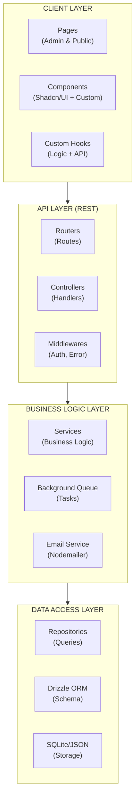

# 🎯 Hệ Thống Quản Lý Hội Nghị Khoa Học

> **Một nền tảng full-stack hiện đại cho việc tổ chức và quản lý hội nghị khoa học chuyên nghiệp**

[](https://www.typescriptlang.org/)
[](https://react.dev/)
[](https://vitejs.dev/)
[](https://expressjs.com/)
[](https://orm.drizzle.team/)
[](https://github.com/vtnguyen04/conference-webpage/actions)

---

## 📋 Mục Lục

- [Giới Thiệu](#-giới-thiệu)
- [Tính Năng Chính](#-tính-năng-chính)
- [Công Nghệ Sử Dụng](#-công-nghệ-sử-dụng)
- [Kiến Trúc Hệ Thống](#-kiến-trúc-hệ-thống)
- [Yêu Cầu Hệ Thống](#-yêu-cầu-hệ-thống)
- [Cài Đặt Nhanh](#-cài-đặt-nhanh)
- [Cấu Hình](#-cấu-hình)
- [Chạy Ứng Dụng](#-chạy-ứng-dụng)
- [Triển Khai Docker](#-triển-khai-docker)
- [API Documentation](#-api-documentation)
- [Testing](#-testing)
- [Xử Lý Sự Cố](#-xử-lý-sự-cố)
- [Đóng Góp](#-đóng-góp)
- [License](#-license)
- [Liên Hệ](#-liên-hệ)

---

## 🌟 Giới Thiệu

Hệ thống quản lý hội nghị khoa học là một giải pháp **full-stack** toàn diện, được thiết kế để hỗ trợ ban tổ chức hội nghị quản lý mọi khía cạnh của sự kiện:

- ✅ **Quản lý đại biểu**: Đăng ký, xác nhận, check-in, QR code
- ✅ **Quản lý phiên**: Nhiều hội thảo song song, quản lý sức chứa
- ✅ **Quản lý nội dung**: Diễn giả, nhà tài trợ, tài liệu
- ✅ **Tự động hóa**: Email xác nhận, chứng nhận tham dự
- ✅ **Check-in hiện đại**: QR code, bulk check-in

### 🎯 Đối Tượng Sử Dụng

- **Ban tổ chức hội nghị**: Quản lý đăng ký, check-in đại biểu
- **Diễn giả**: Đăng ký báo cáo, quản lý phiên
- **Đại biểu**: Đăng ký tham dự, nhận QR code, check-in
- **Nhà tài trợ**: Quản lý thông tin tài trợ

---

## ✨ Tính Năng Chính

### 📝 Đăng Ký & Xác Nhận
- Đăng ký trực tuyến với xác thực email
- Gửi QR code tự động sau khi xác nhận
- Hỗ trợ đăng ký nhiều phiên cùng lúc
- Kiểm tra trùng lịch tự động

### 🎫 Check-in & QR Code
- Check-in bằng QR code cá nhân hóa
- Bulk check-in cho nhiều đại biểu
- Check-in theo phiên cụ thể
- Thống kê real-time

### 📧 Email Automation
- Email xác nhận đăng ký
- Email QR code với thông tin phiên
- Email nhắc nhở xác nhận
- Email chứng nhận tham dự

### 📊 Quản Trị Admin
- Dashboard thống kê chi tiết
- Quản lý đại biểu, phiên, diễn giả
- Export dữ liệu CSV
- Quản lý check-in real-time

### 🎨 UI/UX
- Responsive design (Mobile-first)
- Dark mode support
- Accessibility (WCAG 2.1)
- Loading states & error handling

---

## 🛠 Công Nghệ Sử Dụng

### Frontend
| Technology | Version | Description |
|------------|---------|-------------|
| **React** | 18.2 | UI Library |
| **Vite** | 5.4 | Build Tool |
| **TypeScript** | 5.3 | Type Safety |
| **Tailwind CSS** | 3.4 | Styling |
| **Shadcn/UI** | Latest | Component Library |
| **React Query** | 5.x | Data Fetching |
| **React Hook Form** | 7.x | Form Handling |
| **Zod** | 3.x | Schema Validation |

### Backend
| Technology | Version | Description |
|------------|---------|-------------|
| **Node.js** | 20.x | Runtime |
| **Express** | 4.18 | Web Framework |
| **Drizzle ORM** | 0.32 | Database ORM |
| **SQLite** | 3.x | Database |
| **Nodemailer** | 6.x | Email Service |
| **node-cron** | 3.x | Task Scheduling |
| **QRCode** | 1.5 | QR Generation |
| **Sharp** | 0.33 | Image Processing |

### DevOps & Tools
| Technology | Description |
|------------|-------------|
| **Docker** | Containerization |
| **Vitest** | Testing Framework |
| **ESLint** | Code Linting |
| **Prettier** | Code Formatting |
| **GitHub Actions** | CI/CD |

---

## 🏗 Kiến Trúc Hệ Thống



### Cấu Trúc Thư Mục

```text
conference-webpage/
├── 📁 client/                      # Frontend React Application
│   └── src/
│       ├── services/               # API Service Layer
│       ├── hooks/                  # Custom React Hooks
│       ├── components/             # UI Components
│       │   ├── admin/              # Admin-specific Components
│       │   └── ui/                 # Base UI Components (Shadcn)
│       ├── pages/                  # Page Components
│       ├── lib/                    # Utilities & Config
│       └── main.tsx                # Entry Point
│
├── 📁 server/                      # Backend Express Application
│   ├── routers/                    # API Route Definitions
│   ├── controllers/                # Request Handlers
│   ├── services/                   # Business Logic
│   ├── repositories/               # Data Access Layer
│   ├── middlewares/                # Auth, Error Handling
│   ├── utils/                      # Utilities (Queue, Cron)
│   └── data/                       # SQLite DB & JSON Storage
│
├── 📁 shared/                      # Shared Code
│   ├── schema.ts                   # Database Schema (Drizzle)
│   ├── validation.ts               # Zod Schemas
│   └── types.ts                    # TypeScript Types
│
├── 📁 public/                      # Static Assets
│   └── uploads/                    # User Uploads
│
├── 📄 Dockerfile                   # Docker Configuration
├── 📄 docker-compose.yml           # Docker Compose
├── 📄 .env.example                 # Environment Template
└── 📄 README.md                    # Documentation
```

---

## 💻 Yêu Cầu Hệ Thống

### Phát Triển (Development)
- **Node.js**: 20.x hoặc cao hơn
- **npm**: 10.x hoặc cao hơn
- **Git**: 2.x hoặc cao hơn
- **RAM**: Tối thiểu 4GB
- **Disk**: 2GB trống

### Production (Docker)
- **Docker**: 20.x hoặc cao hơn
- **Docker Compose**: 2.x hoặc cao hơn
- **RAM**: Tối thiểu 2GB
- **CPU**: 2 cores trở lên
- **Disk**: 5GB trống

---

## 🚀 Cài Đặt Nhanh

### 1. Clone Repository

```bash
git clone https://github.com/vtnguyen04/conference-webpage.git
cd conference-webpage
```

### 2. Cài Đặt Dependencies

```bash
# Cài đặt tất cả dependencies
npm install

# Hoặc sử dụng yarn/npm/pnpm
yarn install
```

### 3. Cấu Hình Environment

```bash
# Copy file mẫu
cp .env.example .env

# Chỉnh sửa .env với thông tin của bạn
nano .env
```

### 4. Khởi Tạo Database

```bash
# Push schema vào database
npm run db:push

# (Optional) Mở Drizzle Studio để xem DB
npx drizzle-kit studio
```

### 5. Chạy Development Server

```bash
# Chạy development mode (hot reload)
npm run dev
```

Truy cập: **http://localhost:5000**

---

## ⚙️ Cấu Hình

### Environment Variables (.env)

```env
# ==================== SERVER ====================
PORT=5000
NODE_ENV=development

# ==================== SECURITY ====================
SESSION_SECRET=your-super-secret-key-here
ADMIN_PASSWORD=your-admin-password

# ==================== DATABASE ====================
# SQLite path (default: server/data/main.db)
DATABASE_PATH=./server/data/main.db

# ==================== EMAIL (SMTP) ====================
# Gmail: https://myaccount.google.com/apppasswords
SMTP_HOST=smtp.gmail.com
SMTP_PORT=587
SMTP_SECURE=false
SMTP_USER=your-email@gmail.com
SMTP_PASS=your-app-password
SMTP_FROM="Hội Nghị <noreply@conference.vn>"
EMAIL_FROM=noreply@conference.vn

# ==================== URL ====================
BASE_URL=http://localhost:5000

# ==================== COOKIE ====================
COOKIE_SECURE=false  # true khi dùng HTTPS

# ==================== UPLOAD ====================
UPLOAD_DIR=./public/uploads
MAX_FILE_SIZE=52428800  # 50MB
```

### Email Configuration (Gmail)

1. **Bật xác thực 2 lớp** trong Google Account
2. **Tạo App Password**: https://myaccount.google.com/apppasswords
3. **Dùng App Password** thay cho mật khẩu thường trong `.env`

### Email Configuration (SendGrid)

```env
SMTP_HOST=smtp.sendgrid.net
SMTP_PORT=587
SMTP_USER=apikey
SMTP_PASS=SG.xxxxxxxxxxxxxxxxxxxxx
EMAIL_FROM=noreply@yourdomain.com
```

---

## 🎯 Chạy Ứng Dụng

### Development

```bash
# Development mode với hot reload
npm run dev

# Access: http://localhost:5000
# Admin: http://localhost:5000/admin
```

### Production Build

```bash
# Build cho production
npm run build

# Chạy production server
npm run start
```

### Useful Commands

```bash
# Type checking
npm run check

# Linting
npm run lint

# Testing
npm test

# Build
npm run build

# Database migrations
npm run db:push
npm run db:studio
```

---

## 🐳 Triển Khai Docker

### Build Docker Image

```bash
# Build image
docker build -t conference-app:latest .

# Tag và push (optional)
docker tag conference-app:latest your-username/conference-app
docker push your-username/conference-app
```

### Chạy Container

```bash
docker run -d \
  --name conference-web \
  -p 5000:5000 \
  --env-file .env \
  -v $(pwd)/server/data:/app/server/data \
  -v $(pwd)/public/uploads:/app/public/uploads \
  conference-app:latest
```

### Docker Compose (Recommended)

```yaml
# docker-compose.yml
version: '3.8'

services:
  app:
    build: .
    ports:
      - "5000:5000"
    env_file:
      - .env
    volumes:
      - ./server/data:/app/server/data
      - ./public/uploads:/app/public/uploads
    restart: unless-stopped
```

```bash
# Start với Docker Compose
docker-compose up -d

# Stop
docker-compose down

# View logs
docker-compose logs -f app

# Restart
docker-compose restart
```

### Docker Troubleshooting

```bash
# Xem logs
docker logs conference-web

# Xem container đang chạy
docker ps

# Restart container
docker restart conference-web

# Xóa và tạo lại
docker rm -f conference-web
docker run -d --name conference-web -p 5000:5000 --env-file .env conference-app
```

---

## 📚 API Documentation

### Base URL
```
Development: http://localhost:5000/api
Production: https://your-domain.com/api
```

### Authentication Endpoints

| Method | Endpoint | Description |
|--------|----------|-------------|
| POST | `/auth/login` | Admin login |
| POST | `/auth/logout` | Admin logout |

### Registration Endpoints

| Method | Endpoint | Description |
|--------|----------|-------------|
| POST | `/registrations/batch` | Register for sessions |
| GET | `/registrations/confirm/:token` | Confirm registration |
| GET | `/api/admin/registrations` | Get all registrations (Admin) |
| DELETE | `/api/admin/registrations/:id` | Delete registration (Admin) |
| POST | `/check-ins/manual` | Manual check-in (Admin) |
| POST | `/check-ins/qr` | QR code check-in |

### Session Endpoints

| Method | Endpoint | Description |
|--------|----------|-------------|
| GET | `/sessions` | Get all sessions |
| GET | `/sessions/:id` | Get session by ID |
| POST | `/api/admin/sessions` | Create session (Admin) |
| PUT | `/api/admin/sessions/:id` | Update session (Admin) |
| DELETE | `/api/admin/sessions/:id` | Delete session (Admin) |

### Example: Register for Sessions

```bash
curl -X POST http://localhost:5000/api/registrations/batch \
  -H "Content-Type: application/json" \
  -d '{
    "fullName": "Nguyen Van A",
    "email": "user@example.com",
    "phone": "0987654321",
    "organization": "University",
    "position": "Lecturer",
    "role": "participant",
    "certificateRequested": true,
    "sessionIds": ["session-1", "session-2"]
  }'
```

### Example: QR Check-in

```bash
curl -X POST http://localhost:5000/api/check-ins/qr \
  -H "Content-Type: application/json" \
  -d '{
    "qrData": "CONF|conf-slug|session-id|user@email.com|timestamp",
    "sessionId": "session-id"
  }'
```

---

## 🧪 Testing

### Run Tests

```bash
# Run all tests
npm test

# Run with coverage
npm run test:coverage

# Run specific test file
npx vitest run server/__tests__/integration/registration.test.ts

# Watch mode
npx vitest watch
```

### Test Structure

```
server/__tests__/
├── integration/          # Integration tests
│   ├── auth.test.ts
│   ├── registration.test.ts
│   └── check-in.test.ts
└── services/             # Unit tests
    ├── emailService.test.ts
    ├── registrationService.test.ts
    └── sessionService.test.ts
```

### CI/CD

Tests tự động chạy khi push code lên GitHub qua **GitHub Actions**.

Xem workflow: `.github/workflows/ci.yml`

---

## 🔧 Xử Lý Sự Cố

### Email Không Gửi Được

**Vấn đề**: User đăng ký nhưng không nhận được email QR code.

**Giải pháp**:

1. **Kiểm tra SMTP config** trong `.env`:
   ```bash
   # Test SMTP connection
   node -e "
   const nodemailer = require('nodemailer');
   const transporter = nodemailer.createTransport({
     host: process.env.SMTP_HOST,
     port: process.env.SMTP_PORT,
     auth: { user: process.env.SMTP_USER, pass: process.env.SMTP_PASS }
   });
   transporter.verify((err, success) => console.log(err || success));
   "
   ```

2. **Xem logs**:
   ```bash
   docker logs conference-web 2>&1 | grep -i email
   ```

3. **Dùng Gmail App Password** thay vì mật khẩu thường

4. **Kiểm tra spam folder**

### Database Errors

**Vấn đề**: `SqliteError: no such table`

**Giải pháp**:
```bash
# Reset database
rm server/data/main.db
npm run db:push
```

### Build Errors

**Vấn đề**: Build fails với TypeScript errors

**Giải pháp**:
```bash
# Clear cache
rm -rf node_modules/.vite
npm run dev

# Check types
npm run check
```

### Port Already In Use

**Vấn đề**: `EADDRINUSE: address already in use`

**Giải pháp**:
```bash
# Find process using port 5000
lsof -i :5000

# Kill process
kill -9 <PID>

# Or change PORT in .env
PORT=5001
```

### QR Code Email Chậm

**Vấn đề**: Email QR code gửi chậm (>30 giây)

**Giải pháp**:
- Đã fix: Sử dụng priority queue để gửi ngay lập tức (<5 giây)
- Update code lên version mới nhất

---

## 🤝 Đóng Góp

### Quy Trình Đóng Góp

1. **Fork** repository
2. **Tạo branch** cho feature (`git checkout -b feature/amazing-feature`)
3. **Commit** changes (`git commit -m 'Add amazing feature'`)
4. **Push** lên branch (`git push origin feature/amazing-feature`)
5. **Mở Pull Request**

### Commit Convention

```
feat: Tính năng mới
fix: Sửa lỗi
docs: Cập nhật tài liệu
style: Format code
refactor: Refactor code
test: Thêm tests
chore: Update config, dependencies
perf: Performance improvements
```

### Code Style

- **TypeScript**: Strict mode
- **ESLint**: Airbnb config
- **Prettier**: 2 spaces, single quotes
- **Tailwind**: Utility-first

---

## 📄 License

MIT License - Xem [LICENSE](LICENSE) để biết chi tiết.

---

## 📞 Liên Hệ

### Author

**Vo Thanh Nguyen**
- Email: thcs2nguyen@gmail.com
- GitHub: [@vtnguyen04](https://github.com/vtnguyen04)

### Support

- **Issues**: [GitHub Issues](https://github.com/vtnguyen04/conference-webpage/issues)
- **Discussions**: [GitHub Discussions](https://github.com/vtnguyen04/conference-webpage/discussions)
- **Email**: thcs2nguyen@gmail.com

### Acknowledgments

- **Shadcn/UI**: Component library
- **Drizzle ORM**: Database ORM
- **React Team**: React framework
- **Express Team**: Express framework

---

## 📈 Stats


---

<p align="center">
  <strong>Nếu bạn thấy project hữu ích, hãy để lại ⭐️ star nhé!</strong>
</p>

---

*Cập nhật lần cuối: Tháng 4, 2026*
